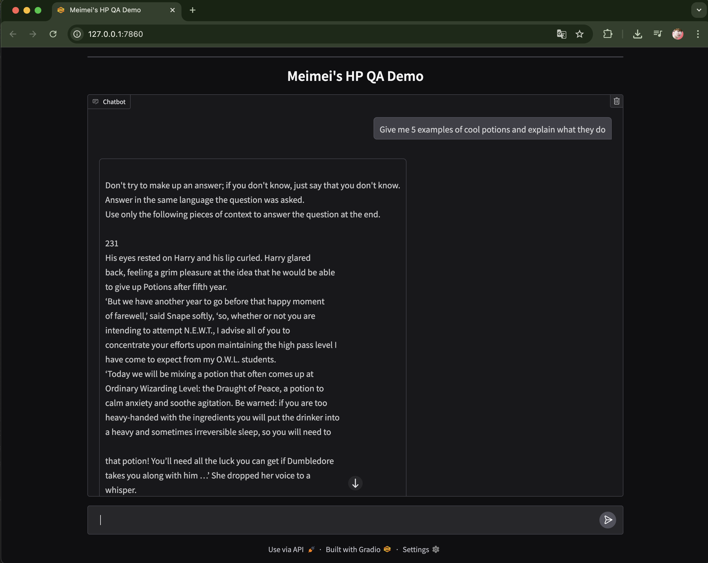
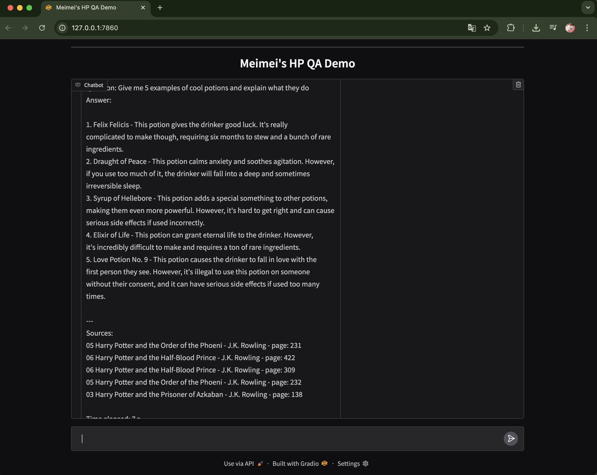

## A Q&A Chatbot about *Harry Potter* Books
This project is a Q&A chatbot built on top of **Large Language Models (LLMs)**, designed to answer questions about the *Harry Potter* book series.  
It leverages the following tools and libraries:

- [Hugging Face](https://huggingface.co/) — Pretrained embeddings and transformer models
- [LangChain](https://www.langchain.com/) — Framework for chaining LLMs with retrieval and orchestration
- [FAISS](https://faiss.ai/) — Facebook AI Similarity Search library for efficient vector similarity search
- [Gradio](https://www.gradio.app/) — Build interactive web-based demos

---

## Table of Contents
- [Remote & Local Machine Setup](#Remote--Local-Machine-Setup)
- [Environment Setup](#environment-setup)
- [Supported Models](#supported-models)
- [Retrieval-Augmented Generation (RAG) Pipeline with LangChain](#retrieval-augmented-generation-rag-pipeline-with-langchain)
  - [1. Load Multiple PDFs](#1-load-multiple-pdfs)
  - [2. Text Splitting](#2-text-splitting)
  - [3. Embedding & Vector Store](#3-embedding--vector-store)
  - [4. Retrieval & Question Answering](#4-retrieval--question-answering)
- [Interact with Gradio UI](#Interact-with-Gradio-UI)

## Remote & Local Machine Setup
🔹 1. Start Jupyter Lab on the remote machine
```
tmux new -s jl
jupyter lab --no-browser --port=8888
```
This will launch Jupyter Lab and show you a URL containing `token=xxxx`.

🔹 2. Use SSH port forwarding from your local machine
```
ssh -p 19880 -L 8888:local:8888 xinyi@remote
```
Then open in your browser:
```arduino
http://local:8888
```

🔹 If you also want to use a UI (e.g., Gradio)
```
ssh -p 19880 \
    -L 8888:local:8888 \
    -L 7860:local:7860 \
    xinyi@remote
```

🔹 Check port usage
On the remote server, run:：
```
netstat -tulnp | grep 7860
```
This shows which process is occupying port 7860.

🔹 Kill the occupying process
If it’s an old Gradio/Jupyter session not closed properly, you can kill it:
```
kill -9 <PID>
```

✅ You can open Jupyter via:
```
http://localhost:8888
```

✅ If you launch Gradio in the notebook with server_port=7860, you can access it at:
```
http://localhost:7860
```

## Environment Setup

First, create the conda environment from the exported `environment.yml`:
```bash
conda env create -f environment.yml
```
---

## Supported Models

| Model              | Parameters | Repo Link                                                                 | Description                                                                 |
|--------------------|------------|----------------------------------------------------------------------------|-----------------------------------------------------------------------------|
| **WizardLM**       | 7B         | [TheBloke/wizardLM-7B-HF](https://huggingface.co/TheBloke/wizardLM-7B-HF) | Instruction-tuned LLaMA variant optimized for reasoning and Q&A tasks.      |
| **LLaMA 2 Chat**   | 7B         | [daryl149/llama-2-7b-chat-hf](https://huggingface.co/daryl149/llama-2-7b-chat-hf) | Lightweight conversational model, good for dialogue and interactive chat.   |
| **LLaMA 2 Chat**   | 13B        | [daryl149/llama-2-13b-chat-hf](https://huggingface.co/daryl149/llama-2-13b-chat-hf) | Larger conversational model with more nuanced and coherent responses.       |
| **Mistral**        | 7B         | [mistralai/Mistral-7B-v0.1](https://huggingface.co/mistralai/Mistral-7B-v0.1) | Efficient transformer with strong reasoning and benchmark performance.      |

---

## Retrieval-Augmented Generation (RAG) Pipeline with LangChain

This project implements a **RAG workflow** using [LangChain](https://www.langchain.com/), allowing users to query the *Harry Potter* book series in natural language.

### 1. Load Multiple PDFs
- Convert `.epub` files to `.pdf` using [Calibre](https://calibre-ebook.com/):  
  ```bash
  brew install --cask calibre
  ```
- Batch conversion script: `./convert_epub2pdf.sh`
- Example usage:
```
cd "/Users/xinyi.wang/downloads/Harry Potter UK Edition"
chmod +x convert_epub2pdf.sh
./convert_epub2pdf.sh.sh
scp -P 19880 -r ~/downloads/"Harry Potter UK Edition"/pdf_out xinyi@xx.xx.xx.xxx:~/LLMs/input
```
- PDFs are loaded from a specified directory using `DirectoryLoader` and `PyPDFLoader`.
- Supports multi-threaded loading for efficiency.
- Example: 7 PDF books (~3625 pages) are ingested.

---
### 2. Text Splitting

- Documents are chunked into smaller pieces to optimize retrieval.

- Splitting ensures manageable context size for embedding and LLM input.

---
### 3. Embedding & Vector Store
- Uses [Sentence-Transformers](https://www.sbert.net/) from Hugging Face.
- Embedding model: `all-MiniLM-L6-v2`
- Stores vectors in [FAISS](https://faiss.ai/), enabling fast similarity search.

**Embedding Model**

For vectorization, the project uses a Hugging Face **Sentence Transformer** model:

| Model Alias | Hugging Face Repo                                                                 | Description                                                                 |
|-------------|------------------------------------------------------------------------------------|-----------------------------------------------------------------------------|
| **MiniLM-L6-v2** | [sentence-transformers/all-MiniLM-L6-v2](https://huggingface.co/sentence-transformers/all-MiniLM-L6-v2) | A lightweight 384-dimensional sentence transformer providing a good balance between speed and accuracy. Ideal for semantic search and retrieval tasks. |

---
### 4. Retrieval & Question Answering

- A retriever fetches the most relevant text chunks from FAISS.

- LangChain’s `RetrievalQA` combines context with the chosen LLM (WizardLM, LLaMA2, Mistral).

## Interact with Gradio UI

Users can query interactively via [Gradio](https://www.gradio.app/).

### Demo Screenshots
- Ask a question


- Get the answer based on the context


---
This project was inspired by this [Kaggle notebook](https://www.kaggle.com/code/hinepo/q-a-chatbot-with-llms-harry-potter/notebook).

